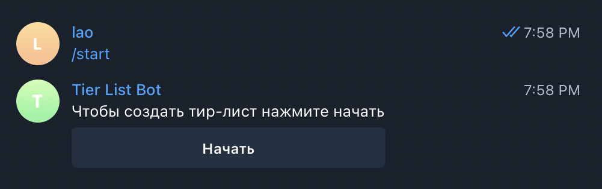
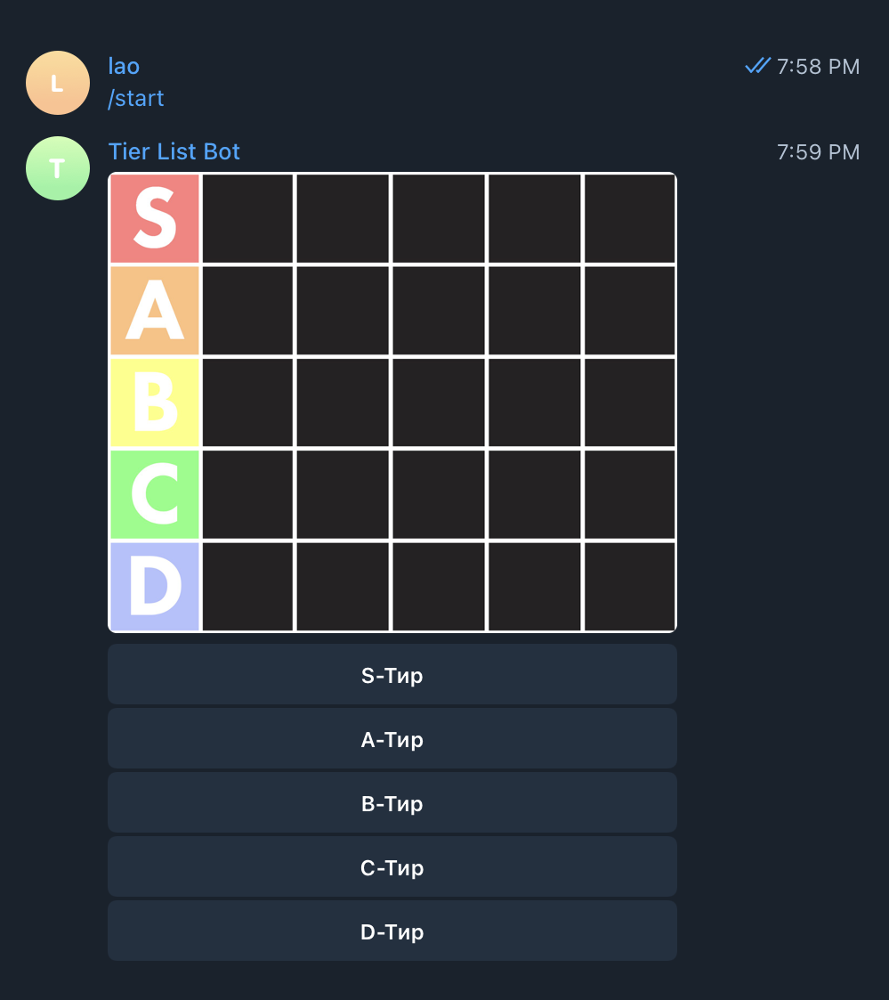
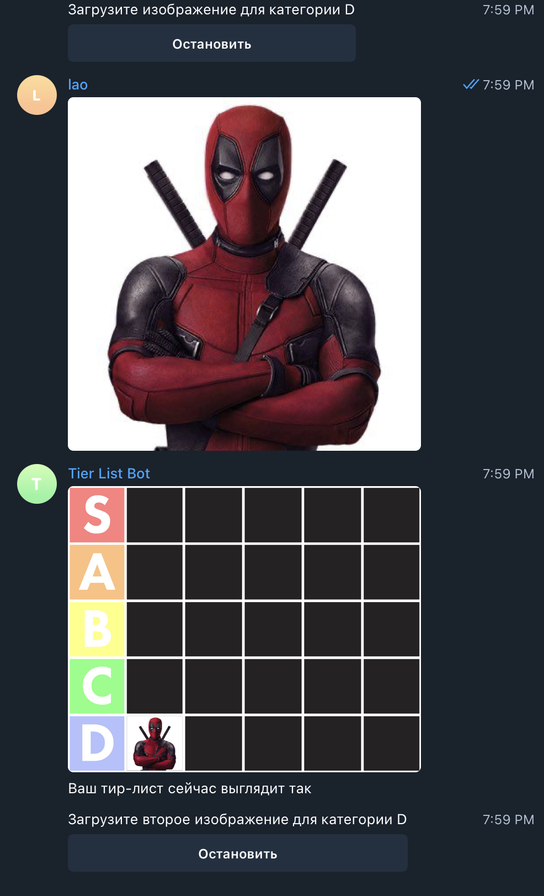
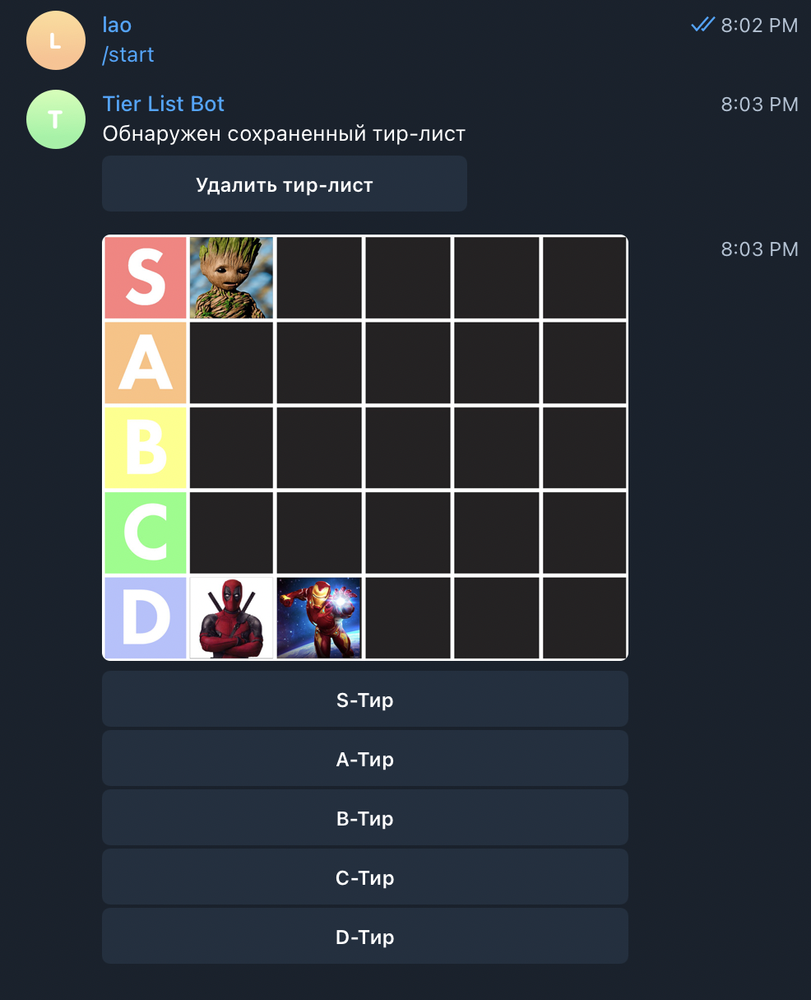
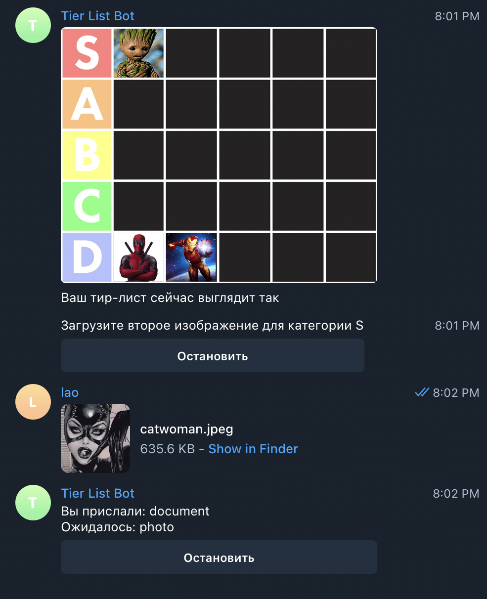
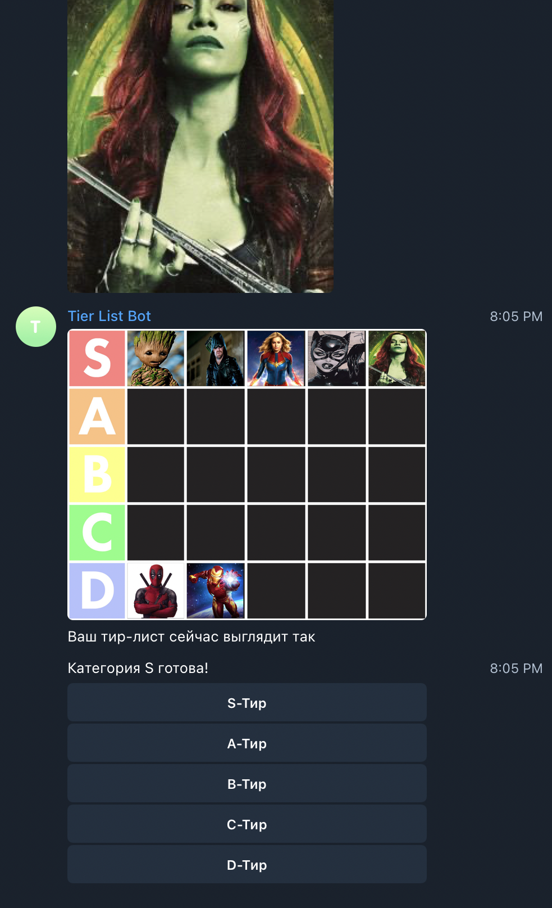
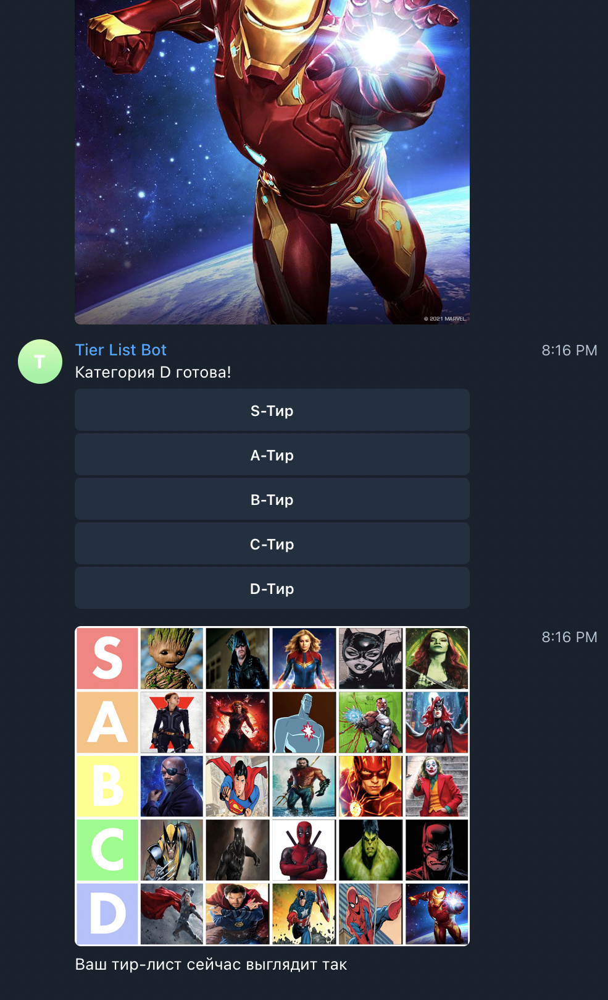

<h1 align="center">
  Tier List Bot
</h1>

<p align="center">
  Easy-to-use tier list maker in Telegram
</p>


* [Usage](#usage)
* [Installation](#installation)


## Screenshots
### Example of making a Marvel and DC superheroes tier list:
<p>
  </br>
  </br>
  </br>
  </br>
  </br>
  </br>
  
</p>


## Usage
This repository is already configured for using on hostings. Review [installation](#installation) steps.


## Installation
First of all, you need to set environment variable *TIERLIST_BOT_TOKEN*, or just enter your bot's API token right in the [bot.py](https://github.com/codelao/Tier-List-Bot/blob/main/bot.py) script (unsafe)

### macOS/Linux
*Note:* you need to have Python3 and Git installed in your system before moving to the bot installation steps.
1. Install
```
git clone https://github.com/codelao/Tier-List-Bot.git && cd Tier-List-Bot && pip3 install -r requirements.txt && chmod +x bot.py
```
2. Run
```
./bot.py
```

### Windows 10/11
*Note:* you need to have Python3 and Git installed in your system before moving to the bot installation steps.
1. Install
```
git clone https://github.com/codelao/Tier-List-Bot.git && cd Tier-List-Bot && pip3 install -r requirements.txt
```
2. Run
```
python3 bot.py
```
